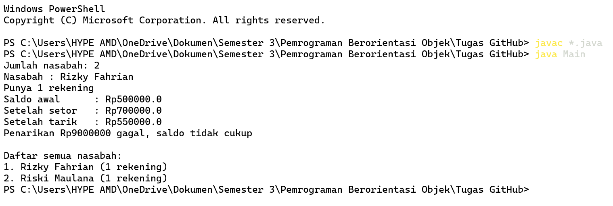

# 🏦 Sistem Perbankan Sederhana

**Simulasi sistem perbankan sederhana berbasis Java & Object-Oriented Programming**


*Kelola nasabah, buka banyak rekening, setor, dan tarik saldo lewat kode Java yang rapi dan mudah dipahami.* 💸

---

## 📖 Tentang Proyek

Proyek ini adalah sistem perbankan mini yang dibuat untuk mempraktikkan konsep **Object-Oriented Programming (OOP)** di Java, seperti **encapsulation**, **class & object**, serta **relasi antar class** (*composition*).

Dalam sistem ini, sebuah **Bank** dapat memiliki banyak **Customer** (nasabah), dan setiap **Customer** dapat memiliki lebih dari satu **Account** (rekening) dengan saldo masing-masing.

## ✨ Fitur

- 👥 **Manajemen Nasabah**: tambah nasabah baru ke bank dan ambil datanya berdasarkan nomor urut
- 💳 **Banyak Rekening**: satu nasabah bisa punya banyak rekening (memakai `ArrayList`)
- 💰 **Setor (Deposit)**: tambah saldo dengan validasi (hanya nominal lebih dari 0)
- 🏧 **Tarik (Withdraw)**: tarik saldo dengan pengecekan nominal dan kecukupan saldo
- 🛡️ **Encapsulation**: semua atribut bersifat `private` dan diakses lewat method
- 🚧 **Proteksi Kapasitas**: mencegah `ArrayIndexOutOfBoundsException` saat bank penuh

## 📸 Hasil Output



## 🧩 Struktur Class

```
📦 Sistem-Perbankan-Sederhana
 ┣ 📜 Main.java       → Titik masuk program & pengujian
 ┣ 📜 Bank.java       → Menyimpan & mengelola daftar nasabah
 ┣ 📜 Customer.java   → Data nasabah & daftar rekening miliknya
 ┗ 📜 Account.java    → Saldo, setor, dan tarik
```

### Relasi Antar Class

```
 Bank  ──1────*──▶  Customer  ──1────*──▶  Account
(maks 10 nasabah)  (banyak rekening)     (saldo & transaksi)
```

| Class      | Tanggung Jawab                        | Method Utama                                                                            |
| ---------- | ------------------------------------- | --------------------------------------------------------------------------------------- |
| `Account`  | Mengelola saldo                       | `getBalance()`, `deposit()`, `withdraw()`                                               |
| `Customer` | Menyimpan identitas & rekening nasabah | `getFirstName()`, `getLastName()`, `setAccount()`, `getAccount()`, `getNumOfAccounts()` |
| `Bank`     | Menyimpan kumpulan nasabah            | `addCustomer()`, `getCustomer()`, `getNumOfCustomers()`                                 |
| `Main`     | Menjalankan simulasi                  | `main()`                                                                                |

## 🚀 Cara Menjalankan

### Prasyarat

- ☕ **JDK 8** atau lebih baru

Cek instalasi Java kamu:

```
java -version
```

### Langkah-langkah

**1. Clone repository**

```
git clone https://github.com/13_Rizky Fahrian Subban/PBO-ArrayandArrayList.git
cd PBO-ArrayandArrayList
```

**2. Compile semua file**

```
javac *.java
```

**3. Jalankan program**

```
java Main
```

## 🖥️ Contoh Output

```
Jumlah nasabah: 2
Nasabah : Rizky Fahrian
Punya 2 rekening
Saldo awal      : Rp500000.0
Setelah setor   : Rp700000.0
Setelah tarik   : Rp550000.0
Penarikan Rp9000000 gagal, saldo tidak cukup

Daftar semua nasabah:
1. Rizky Fahrian (2 rekening)
2. Riski Maulana (0 rekening)
```

## 🔍 Alur Simulasi di `Main.java`

1. Membuat objek `Bank`
2. Menambahkan 2 nasabah: **Rizky Fahrian** dan **Riski Maulana**
3. Mengambil nasabah pertama, lalu membuatkan 2 rekening (Rp500.000 & Rp1.500.000)
4. Menampilkan nama nasabah dan jumlah rekeningnya
5. Melakukan **setor Rp200.000** dan **tarik Rp150.000** pada rekening pertama
6. Mencoba **tarik Rp9.000.000** (melebihi saldo), hasilnya ditolak
7. Menampilkan semua nasabah di bank memakai perulangan `for`

## 🗃️ Implementasi Array & ArrayList

Proyek ini memakai **dua struktur data berbeda** untuk menyimpan objek, sehingga cocok untuk membandingkan keduanya secara langsung.

### 1️⃣ Array → `Customer[]` di class `Bank`

Array punya **ukuran tetap** yang ditentukan saat dibuat. Di sini kapasitas bank dibatasi **10 nasabah**.

```java
private Customer[] customers;     // array untuk menyimpan nasabah
private int numberOfCustomers;    // penanda posisi kosong berikutnya

public Bank() {
    customers = new Customer[10]; // ukuran tetap: 10
    numberOfCustomers = 0;
}
```

Karena array tidak punya method `add()` bawaan, kita memakai variabel **`numberOfCustomers`** sebagai penunjuk posisi kosong berikutnya:

```java
public void addCustomer(String namaDepan, String namaBelakang) {
    if (numberOfCustomers < customers.length) {   // cek kapasitas dulu
        customers[numberOfCustomers] = new Customer(namaDepan, namaBelakang);
        numberOfCustomers++;                      // geser penanda
    } else {
        System.out.println("Maaf, bank sudah penuh!");
    }
}
```

Pengecekan batas juga dilakukan saat mengambil data, supaya tidak terjadi `ArrayIndexOutOfBoundsException`:

```java
public Customer getCustomer(int nomorUrut) {
    if (nomorUrut >= 0 && nomorUrut < numberOfCustomers) {
        return customers[nomorUrut];
    } else {
        return null;
    }
}
```

### 2️⃣ ArrayList → `ArrayList<Account>` di class `Customer`

`ArrayList` punya **ukuran dinamis**: otomatis bertambah saat elemen ditambahkan, jadi satu nasabah bisa punya rekening sebanyak apa pun.

```java
private ArrayList<Account> accounts;

public Customer(String namaDepan, String namaBelakang) {
    firstName = namaDepan;
    lastName = namaBelakang;
    accounts = new ArrayList<Account>();  // mulai dari list kosong
}
```

Tidak perlu penanda manual, cukup pakai method bawaan `add()`, `get()`, dan `size()`:

```java
public void setAccount(Account rekeningBaru) {
    accounts.add(rekeningBaru);           // tambah rekening, ukuran menyesuaikan
}

public Account getAccount(int nomorUrut) {
    if (nomorUrut >= 0 && nomorUrut < accounts.size()) {
        return accounts.get(nomorUrut);
    } else {
        return null;
    }
}

public int getNumOfAccounts() {
    return accounts.size();               // jumlah rekening saat ini
}
```

### ⚖️ Perbandingan

| Aspek            | Array (`Customer[]`)                            | ArrayList (`ArrayList<Account>`)                       |
| ---------------- | ----------------------------------------------- | ------------------------------------------------------ |
| **Ukuran**       | Tetap (10)                                      | Dinamis, tumbuh otomatis                               |
| **Tambah data**  | Manual: `customers[i] = ...` lalu `i++`         | `accounts.add(...)`                                    |
| **Ambil data**   | `customers[i]`                                  | `accounts.get(i)`                                      |
| **Jumlah data**  | Dilacak sendiri (`numberOfCustomers`)           | `accounts.size()`                                      |
| **Risiko error** | Mudah `ArrayIndexOutOfBounds` jika tidak dicek  | Tetap perlu cek nomor urut, tapi tidak ada batas kapasitas |
| **Dipakai di**   | `Bank`                                          | `Customer`                                             |

> 💡 **Kesimpulan:** gunakan **array** bila jumlah data sudah pasti atau dibatasi, dan **ArrayList** bila jumlah data tidak bisa diprediksi.

## 💡 Konsep OOP yang Diterapkan

| Konsep            | Penerapan                                                        |
| ----------------- | ---------------------------------------------------------------- |
| **Encapsulation** | Atribut `private` + getter/method publik                         |
| **Constructor**   | Inisialisasi saldo awal & data nasabah                           |
| **Composition**   | `Bank` memiliki `Customer`, `Customer` memiliki `Account`        |
| **Validasi Data** | Setor hanya untuk nominal > 0, tarik hanya jika saldo cukup      |
| **Collections**   | `ArrayList<Account>` untuk daftar rekening dinamis               |

## 🛣️ Rencana Pengembangan

- [x] Validasi nominal negatif pada `withdraw()`
- [ ] Menu interaktif dengan input dari pengguna (`Scanner`)
- [ ] Fitur transfer antar rekening
- [ ] Riwayat transaksi
- [ ] Penyimpanan data ke file / database

## 👨‍💻 Identitas Pembuat

|              |                        |
| ------------ | -------------------    |
| 👤 **Nama**  | *Rizky Fahrian Subban* |
| 🆔 **NIM**   | *F1D02510090*          |
| 🏫 **Kelas** | *INFORMATIKA B*        |

Dibuat dengan ☕ dan semangat belajar Java.

---

⭐ Kalau proyek ini membantu, jangan lupa kasih **star** ya! ⭐
